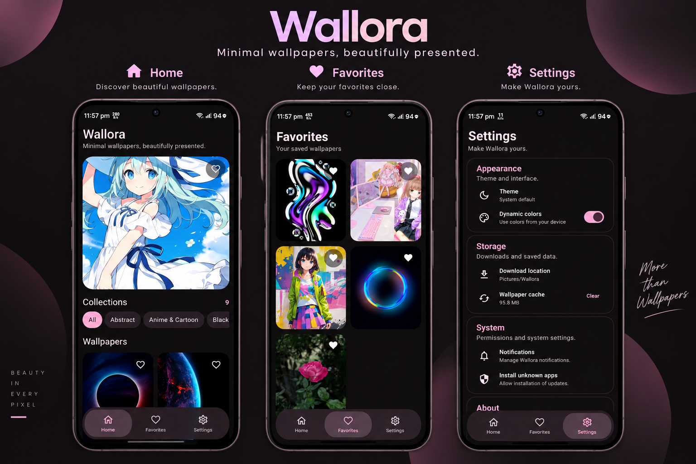

<p align="center">
  
</p>

<p align="center">
  <strong>Beautiful wallpapers. Simple experience.</strong><br>
  A modern Android wallpaper app built with Kotlin and Jetpack Compose.
</p>

<p align="center">
  
  
  
  
</p>

---

## ✨ Features

- 🖼️ Discover curated wallpapers and collections
- ❤️ Save wallpapers to Favorites
- 🔍 Search and filter the wallpaper catalog
- 👀 Preview wallpapers in full screen
- 📥 Download wallpapers with Android notifications
- 📲 Apply wallpapers to the Home screen, Lock screen, or both
- 🔄 Check for app updates from GitHub Releases
- 🎨 Clean Material 3 interface with dynamic theming

## 📸 Screenshots

<p align="center">
  
</p>

## 🧰 Tech Stack

- **Kotlin**
- **Jetpack Compose**
- **Material 3**
- **AndroidX**
- **Coil 3** for image loading
- **OkHttp** for networking
- **Moshi** for JSON parsing
- **WorkManager** for background work
- **Gradle + GitHub Actions**

## 🚀 Quick Start

### Requirements

- Android Studio
- JDK 17
- Android SDK 37
- Android 8.0 (API 26) or newer

### Clone

```bash
git clone https://github.com/Darkstar085/Wallora.git
cd Wallora
```

### Build

The repository includes the Gradle wrapper.

```bash
./gradlew assembleDebug
```

The generated debug APK is placed under `app/build/outputs/apk/debug/`.

For a release build:

```bash
./gradlew assembleRelease
```

Release signing uses:

```text
ANDROID_KEYSTORE_PATH
ANDROID_KEYSTORE_PASSWORD
ANDROID_KEY_ALIAS
ANDROID_KEY_PASSWORD
```

## 📦 Releases

Download the latest APK from the repository's [Releases](https://github.com/Darkstar085/Wallora/releases) page.

## 🖼️ Wallpaper Catalog

Wallora reads `api/wallpapers.json` from [Darkstar085/Wallpapers](https://github.com/Darkstar085/Wallpapers).

Wallpaper images are maintained separately and may have their own licensing and attribution requirements.

## 🤝 Contributing

Contributions, bug reports, and improvements are welcome. Keep changes focused and follow the existing Kotlin, Jetpack Compose, and Conventional Commit conventions.

## 📄 License

Wallora is licensed under the [MIT License](LICENSE).

---

<p align="center">
  <strong>Wallora</strong> — Wallpapers for a brighter you.
</p>
